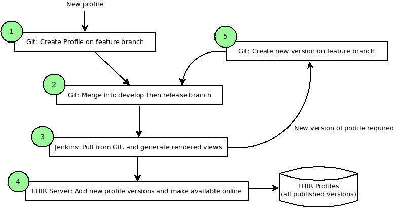

# FHIR Versioning Demo

Created for a WebEx with INTEROPen on 26th May 2017.

## Basic process flow

The below diagram shows the basic flow for creating new profiles, then creating new versions for publication on the FHIR server.

### Step 1

- Create a new profile in a Github repository.
- In practice this could be a StructureDefinition, ValueSet, OperationDefinition or ImplementationGuide.
- For our demo we will create a StructureDefinition - [this one](./StructureDefinitions/Adam-Patient-Profile.xml)
- Note - this profile has:
	- An **ID**, which is in the **url** element: https://fhir.nhs.uk/StructureDefinition/**adam-patient**
	- A **Name**, which is in the **name** element: **Adams Patient Profile** - this is largely for human display
	- A **Status**, which is either draft, active or retired
	- A **Version**, which can be anything, but we are assuming it will follow the semantic versioning standard major.minor.patch - e.g. **1.0**
- Also note that the filename of this file is not significant - it can be anything!

### Step 2

- When the profile is in a suitable state, it can be promoted through the usual gitflow process into the develop branch, then into a release branch, and ultimately the master branch.

### Step 3

- When the resources are ready to be published, the Jenkins build server can then trigger a set of automated tasks to generate a rendered view of the profiles (snapshots, differentials, bindings, etc.)
- The code for this is [here](https://github.com/health-and-care-developer-network/fhir-profile-renderer)

### Step 4

- The profiles and associated rendered views are put into a directory on the FHIR server, which processes them
- The FHIR server looks at the IDs and versions of the various resources, and publishes them
- Older versions that were previously published in this way are kept, so they are still available for systems that reference
- The code for the FHIR server is [here](https://github.com/health-and-care-developer-network/fhir-reference-server)
- The published profile is now available on the FHIR server:
	- Users accessing them through a web browser will see the rendered version
	- FHIR clients and tools accessing them will get the raw FHIR profile resources back - as per the FHIR specification
- The example for our demo is [here](https://fhir-test.nhs.uk/StructureDefinitions/adam-patient)

### Step 5

- Now, when we want to change the profile, we can edit it in a new feature branch
- We can simply make any changes we need to the profile and increase the version number inside the file
- When we are ready, we can merge and publish it again as per steps 2, 3 and 4 above.
- Now, the profile on the FHIR server has two versions - both of which can be seen in the browser and accessed from FHIR clients using the standard FHIR versioned URLs
- So, in the case of our demo profile we can see:
	- The original version [here](https://fhir-test.nhs.uk/StructureDefinitions/adam-patient/_history/1.0)
	- And the new version [here](https://fhir-test.nhs.uk/StructureDefinitions/adam-patient/_history/1.1)
- Users will see the latest by default, but can select any other versions easily - the versioned URLs for old versions will never change and can be relied upon by clients.

